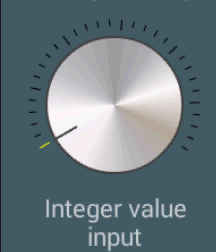
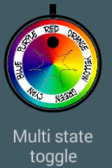
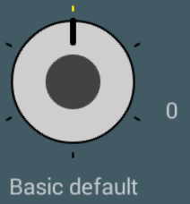
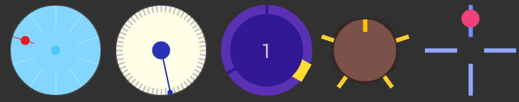

# Rotary Knob Selector

A customizable selector that replicates the behaviour of a knob with discrete values.  

 
The knob is a powerful tool. For some reason, anyway, it's rarely used, and I could not find it in the Android panorama.
But the rotating knob has a lot of advantages over other radio-buttons, seek bars or other selectors:

* It's usage is immediately clear to the user, because it also exists in the physical world
* It has an immediate graphical indication of the current value, the number of choices and where the value is in the overall range
* It docks in a very small space: it requires the same space no matter how many choices are there, and it can adapt itself when the amount changes. Furthermore, swipe gestures allow to change values very quickly, using the entire screen for the gesture, but only a tiny zone of it for the graphics.
* Works fine also with few choices, as a multi-state toggle.
  
Possible usages are:
* Replacement for a radio button, with 2 up to dozen of choices
* Replacement for a integer value input or seek bar, with large ranges up to hundreds
* Replacement for a ViewPager indicator, for fast scrolling pages without using an entire line of the screen

<i>This version is still in beta and still misses a number of features that are going to be added in the next future.</i>  

### Setup
In your project's build.gradle file:

    allprojects {
        repositories {
            ...
            maven { url "https://jitpack.io" }
            ...
        }
    }

In your Application's or Module's build.gradle file:

    dependencies {
        ...
        compile 'com.github.BeppiMenozzi:Knob:1.9.0'
        ...
    }

### Minimal usage
Layout:

    ...
    xmlns:app="http://schemas.android.com/apk/res-auto"
    ...
    <it.beppi.knoblibrary.Knob
            android:layout_width="64dp"
            android:layout_height="64dp"
            android:id="@+id/knob"
            app:kNumberOfStates="6"
     />

Listener:

    ...
    Knob knob = (Knob) findViewById(R.id.knob);
    knob.setState(firstState);
    knob.setOnStateChanged(new Knob.OnStateChanged() {
            @Override
            public void onState(int state) {
            // do something
            }
        });

    ...

 
As default, nearly all features are disabled and the default knob is minimal: 
 
This is what you will have with this default configuration. Feel free to grab graphics and configurations from the sample as you like to match your own needs.
  Some other fancy configurations that you can find in the sample: 
 

### Graphical structure
The Knob is completely customizable. The many customizable attributes can all be set both via xml file, and programmatically.  
Let's analyze the structure to understand how it is drawn before digging into the customization. The knob is made of these parts:  
* A circle that represents the knob. The knob does not necessarily occupy the entire size of the view, but can be slightly smaller to leave space for, for example, the markers.
* A set of markers that represent the available values. The markers are lines drawn from the edge of the largest possible circle inside the view towards the center. Therefore, they can lie outside or inside the knob. One of the markers is "selected" and can have its own color.
* An indicator that represents the current value. The indicator is a line drawn from the knob circle edge towards the center. To the indicator a spring animation is applied.
* A circular indicator that works exactly like the normal indicator, but is a drawn as a circle. The two ndicators can live alone or together.
* A circle that represents the knob center.
* An empty circle that represents the knob border.  

### Customization
Here is the list of the xml attributes that can be used to customize the View. All these attributes are available programmatically too with the same names.
<table>
<tr><th colspan="2">General</th></tr>
<tr><td><b>kNumberOfStates</b></td><td>Number of possible states. States are numbered from 0 to n-1. This number can be changed runtime, and the indicator will adjust its position accordingly.</td></tr>
<tr><td><b>kDefaultState</b></td><td>The starting state of the knob.</td></tr>
<tr><td><b>kClickBehaviour</b></td><td>What is expected when the knob is clicked. Next value, previous value, reset to default value, let the user select with a popup menu, define a custom listener. Default is next. Warning: the popup menu is available only with Compat. Warning: the customer listener (a Runnable) should be defined runtime, with <i>setUserBehaviour()</i></td></tr>
<tr><td><b>kAnimation</b></td><td>Enable / disable indicator's animation.</td></tr>
<tr><td><b>kAnimationSpeed</b></td><td>Parameter "speed" applied to the spring physical model for the indicator's animation.</td></tr>
<tr><td><b>kAnimationBounciness</b></td><td>Parameter "bounciness" applied to the spring physical model for the indicator's animation.</td></tr>
<tr><td><b>kEnabled</b></td><td>Enable / disable knob.</td></tr>
<tr><th colspan="2">Knob appearance</th></tr>
<tr><td><b>kKnobColor</b></td><td>Color of the knob.</td></tr>
<tr><td><b>kKnobRelativeRadius</b></td><td>Radius of the knob, relative to the largest possible circle inside the view. 1 = fill all the view, 0.5 = fill half of the view.</td></tr>
<tr><td><b>kKnobCenterColor</b></td><td>Color of the center of the knob.</td></tr>
<tr><td><b>kKnobCenterRelativeRadius</b></td><td>Radius of the center, relative to the radius of the knob. 0 = disable.</td></tr>
<tr><td><b>kBorderWidth</b></td><td>Width of the external circle. 0 = disable.</td></tr>
<tr><td><b>kBorderColor</b></td><td>Color of the external circle.</td></tr>
<tr><td><b>kKnobDrawable</b></td><td>Allows to override a color configuration and set a drawable as the knob graphics. If this is present, both kKnob* and kKnobCenter* attributes will be ignored.</td></tr>
<tr><td><b>kKnobDrawableRotates</b></td><td>When this is true, the drawable will be rotated accordingly, otherwise it will stay still.</td></tr>
<tr><th colspan="2">State markers appearance</th></tr>
<tr><td><b>kStateMarkersWidth</b></td><td>Width of the line markers.</td></tr>
<tr><td><b>kStateMarkersRelativeLength</b></td><td>Length of the line markers, relative to the largest possible circle inside the view. 1 = draw from edge to center, 0.5 = draw half length, starting from the edge.</td></tr>
<tr><td><b>kStateMarkersColor</b></td><td>Color of the line markers.</td></tr>
<tr><td><b>kSelectedStateMarkerColor</b></td><td>Color of the selected line marker.</td></tr>
<tr><td><b>kSelectedStateMarkerContinuous</b></td><td>If the continuous mode is chosen, the knob will act like a gauge, selecting all the markes from the minimum to the current value. When this is false, only one marker is selected at any time.</td></tr>
<tr><td><b>kStateMarkersAccentWidth</b></td><td>These attributes allow to create different "more important" markers, like on a normal clock are the minutes divisible by 5</td></tr>
<tr><td><b>kStateMarkersAccentColor</b></td></tr>
<tr><td><b>kStateMarkersAccentRelativeLength</b></td></tr>
<tr><td><b>kStateMarkersAccentPeriodicity</b></td><td>How often these markers are shown. 0 = disable.</td></tr>
<tr><th colspan="2">Indicators appearance</th></tr>
<tr><td><b>kIndicatorWidth</b></td><td>Width of the line indicator. 0 = disable.</td></tr>
<tr><td><b>kIndicatorColor</b></td><td>Color of the line indicator.</td></tr>
<tr><td><b>kIndicatorRelativeLength</b></td><td>Length of the line indicator relative to the knob radius. 1 = from edge to center. 0.5 = from edge to half. 0 = disable.</td></tr>
<tr><td><b>kCircularIndicatorRelativeRadius</b></td><td>Radius of the circle indicator, relative to the knob radius. 0 = disable.</td></tr>
<tr><td><b>kCircularIndicatorRelativePosition</b></td><td>Distance of the circle indicator from the center, relative to the largest possible circle inside the view. 1 = put on edge, 0.5 = put half way.</td></tr>
<tr><td><b>kCircularIndicatorColor</b></td><td>Color of the circular indicator.</td></tr>
<tr><th colspan="2">Swipe behaviour</th></tr>
<tr><td><b>kSwipe</b></td><td>Enable swipe. Values: off, vertical, horizontal, both or circular (default: circular).</td></tr>
<tr><td><b>kSwipeSensitivityPixels</b></td><td>How many pixels are needed for the swipe to make the knob increase value. Higher = slower (default: 100). If the circular swipe gesture is chosen, this parameter is ignored.</td></tr>
<tr><th colspan="2">Rotation and constraints</th></tr>
<tr><td><b>kFreeRotation</b></td><td>Enable free rotation. When false, after reaching maximum or minimum the indicator will stop, when true the value will continue in a round-robin fashion. Default: true</td></tr>
<tr><td><b>kMinAngle</b></td><td>Put constraints on the indicator. This allows to create indicators that span only one arc, and don't cover the entire circumference, like, for example, a speedometer. If this and the next parameters are set, generally they go together with kFreeRotation=off</td></tr>
<tr><td><b>kMaxAngle</b></td></tr>
<tr><th colspan="2">Popup balloons</th></tr>
<tr><td><b>kShowBalloonValues</b></td><td>Enable popup balloon values</td></tr>
<tr><td><b>kBalloonValuesTimeToLive</b></td><td>How long do the popup balloons display. 0 = permanent</td></tr>
<tr><td><b>kBalloonValuesRelativePosition</b></td><td>Relative position of the balloons. 0 = center, 1 = edge. Values >1 are allowed</td></tr>
<tr><td><b>kBalloonValuesTextSize</b></td><td>Balloon's text size</td></tr>
<tr><td><b>kBalloonValuesAnimation</b></td><td>Animation. Choose among *fade*, *pop* or *scale*</td></tr>
<tr><td><b>kBalloonValuesArray</b></td><td>Array of strings for the balloon values. If this is not defined, numbers will be written</td></tr>
<tr><td><b>kBalloonValuesSlightlyTransparent</b></td><td>When true, the balloons will be 75% visibile</td></tr>
</table>

### Dependencies
You don't have to add any dependency.
Internally, this library uses my other <a href="https://github.com/BeppiMenozzi/BalloonPopup">Balloon Popup library</a> to display... guess... balloon popups.

### New in 1.9.0
* Added 'user' click behaviour

### New in 1.8.0
* Fixed: default swipe direction (thanks for pull request)
* Added different onClick behaviours, included the somewhere asked popup menu

### New in 1.7.0
* Added public constants for swipe direction

### New in 1.6.0
* Added swipe in circular fashion
* Changed the default swipe behaviour to circular

### New in 1.5.0
* Fixed: when min and max angles were present, the last marker was not in the correct place
* Added swipe in both directions
* Fixed: balloon now does not exit the window
* minSdkVersion from 9 to 11

### New in 1.4.0
* Fixed swipe behaviour while in ScrollView.

### New in 1.3.0
* Added popup balloons

### New in 1.2.3
* Debug

### New in 1.2.2
* Added samples

### New in 1.2.1
* Added continuous mode

### New in 1.2.0
* Added constrained rotation
* Added min / max angle
* Added accented markers
* Added drawables
* Rewritten angle management (and rotation direction)

### New in 1.1.1
* Debug

### New in 1.1.0
* Added swipe gestures
* Added methods <b>increaseValue()</b> <b>decreaseValue()</b>
* Fixed small things.

### TODO List
* Allow to put multiple indicators

### Known bugs
* BalloonPopup doesn't scroll when inside a ScrollView

Author
-------
* Beppi Menozzi

License
-------
    The MIT License (MIT)

    Copyright (c) 2016 Beppi Menozzi

    Permission is hereby granted, free of charge, to any person obtaining a copy
    of this software and associated documentation files (the "Software"), to deal
    in the Software without restriction, including without limitation the rights
    to use, copy, modify, merge, publish, distribute, sublicense, and/or sell
    copies of the Software, and to permit persons to whom the Software is
    furnished to do so, subject to the following conditions:

    The above copyright notice and this permission notice shall be included in all
    copies or substantial portions of the Software.

    THE SOFTWARE IS PROVIDED "AS IS", WITHOUT WARRANTY OF ANY KIND, EXPRESS OR
    IMPLIED, INCLUDING BUT NOT LIMITED TO THE WARRANTIES OF MERCHANTABILITY,
    FITNESS FOR A PARTICULAR PURPOSE AND NONINFRINGEMENT. IN NO EVENT SHALL THE
    AUTHORS OR COPYRIGHT HOLDERS BE LIABLE FOR ANY CLAIM, DAMAGES OR OTHER
    LIABILITY, WHETHER IN AN ACTION OF CONTRACT, TORT OR OTHERWISE, ARISING FROM,
    OUT OF OR IN CONNECTION WITH THE SOFTWARE OR THE USE OR OTHER DEALINGS IN THE
    SOFTWARE.

