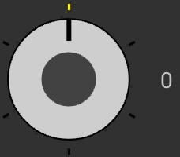

# Rotating Knob Selector

A customizable selector that replicates the behaviour of a knob with discrete values.  
  
The knob is a very powerful tool, that I could not find in the Android panorama:

* It's of immediate understanding to the user
* It occupies a very small space
* It can manage any number of values without taking more space
* It can be used as a way to insert data, and also for navigation as a page selector

<i>This version is still in beta and still misses a number of features that are going to be added in the next future.</i>  

 

### Setup
In your project's build.gradle file:

    allprojects {
        repositories {
            ...
            maven { url "https://jitpack.io" }
            ...
        }
    }

In your Application's or Module's build.gradle file:

    dependencies {
        ...
        compile 'com.github.BeppiMenozzi:Knob:1.0.0'
        ...
    }

### Minimal usage
Layout:

    ...
    xmlns:app="http://schemas.android.com/apk/res-auto"
    ...
    <it.beppi.knoblibrary.Knob
            android:layout_width="64dp"
            android:layout_height="64dp"
            android:id="@+id/knob"
            app:kNumberOfStates="6"
     />

Listener:

    ...
    Knob knob = (Knob) findViewById(R.id.knob);
    knob.setState(firstState);
    knob.setOnStateChanged(new Knob.OnStateChanged() {
            @Override
            public void onState(int state) {
            // do something
            }
        });

    ...

### Graphical structure
The Knob is completely customizable. The many customizable attributes can all be set both via xml file, and programmatically.  
Let's analyze the structure to understand how it is drawn before digging into the customization. The knob is made of these parts:  
* A circle that represents the knob. The knob does not necessarily occupy the entire size of the view, but can be slightly smaller to leave space for, for example, the markers.
* A set of markers that represent the available values. The markers are lines drawn from the edge of the largest possible circle inside the view towards the center. Therefore, they can lie outside or inside the knob. One of the markers is "selected" and can have its own color.
* An indicator that represents the current value. The indicator is a line drawn from the knob circle edge towards the center. To the indicator a spring animation is applied.
* A circular indicator that works exactly like the normal indicator, but is a drawn as a circle. The two ndicators can live alone or together.
* A circle that represents the knob center.
* An empty circle that represents the knob border.  

### Customization
Here is the list of the xml attributes that can be used to customize the View. All these attributes are available programmatically too.
* <b>kNumberOfStates</b> Number of possible states. States are numbered from 0 to n-1. This number can be changed runtime, and the indicator will adjust its position accordingly.
* <b>kDefaultState</b> The starting state of the knob.
* <b>kAnimation</b> Enable / disable indicator's animation.
* <b>kAnimationSpeed</b> Parameter "speed" applied to the spring physical model for the indicator's animation.
* <b>kAnimationBounciness</b> Parameter "bounciness" applied to the spring physical model for the indicator's animation.
* <b>kEnabled</b> Enable / disable knob.
  
* <b>kKnobColor</b> Color of the knob.
* <b>kKnobRelativeRadius</b> Radius of the knob, relative to the largest possible circle inside the view. 1 = fill all the view, 0.5 = fill half of the view.
  
* <b>kStateMarkersWidth</b> Width of the line markers.
* <b>kStateMarkersRelativeLength</b> Length of the line markers, relative to the largest possible circle inside the view. 1 = draw from edge to center, 0.5 = draw half length, starting from the edge.
* <b>kStateMarkersColor</b> Color of the line markers.
* <b>kSelectedStateMarkerColor</b> Color of the selected line marker.
  
* <b>kIndicatorWidth</b> Width of the line indicator. 0 = disable.
* <b>kIndicatorColor</b> Color of the line indicator.
* <b>kIndicatorRelativeLength</b> Length of the line indicator relative to the knob radius. 1 = from edge to center. 0.5 = from edge to half. 0 = disable.
  
* <b>kCircularIndicatorRelativeRadius</b> Radius of the circle indicator, relative to the knob radius. 0 = disable.
* <b>kCircularIndicatorRelativePosition</b> Distance of the circle indicator from the center, relative to the largest possible circle inside the view. 1 = put on edge, 0.5 = put half way.
* <b>kCircularIndicatorColor</b> Color of the circular indicator.
  
* <b>kKnobCenterColor</b> Color of the center of the knob.
* <b>kKnobCenterRedlativeRadius</b> Radius of the center, relative to the radius of the knob. 0 = disable.
  
* <b>kBorderWidth</b> Width of the external circle. 0 = disable.
* <b>kBorderColor</b> Color of the external circle.

### (Still long) TODO List
* assign a drawable to the knob and to the center, choose if it can be rotated or not
* draw important markers (for example, every 5)
* implement gestures
* allow to configure values packed on an arc, rather then on the whole circumference
* allow to put multiple indicators
* make better management of the transition between max value and min value

Author
-------
* Beppi Menozzi

License
-------
    The MIT License (MIT)

    Copyright (c) 2016 Beppi Menozzi

    Permission is hereby granted, free of charge, to any person obtaining a copy
    of this software and associated documentation files (the "Software"), to deal
    in the Software without restriction, including without limitation the rights
    to use, copy, modify, merge, publish, distribute, sublicense, and/or sell
    copies of the Software, and to permit persons to whom the Software is
    furnished to do so, subject to the following conditions:

    The above copyright notice and this permission notice shall be included in all
    copies or substantial portions of the Software.

    THE SOFTWARE IS PROVIDED "AS IS", WITHOUT WARRANTY OF ANY KIND, EXPRESS OR
    IMPLIED, INCLUDING BUT NOT LIMITED TO THE WARRANTIES OF MERCHANTABILITY,
    FITNESS FOR A PARTICULAR PURPOSE AND NONINFRINGEMENT. IN NO EVENT SHALL THE
    AUTHORS OR COPYRIGHT HOLDERS BE LIABLE FOR ANY CLAIM, DAMAGES OR OTHER
    LIABILITY, WHETHER IN AN ACTION OF CONTRACT, TORT OR OTHERWISE, ARISING FROM,
    OUT OF OR IN CONNECTION WITH THE SOFTWARE OR THE USE OR OTHER DEALINGS IN THE
    SOFTWARE.

